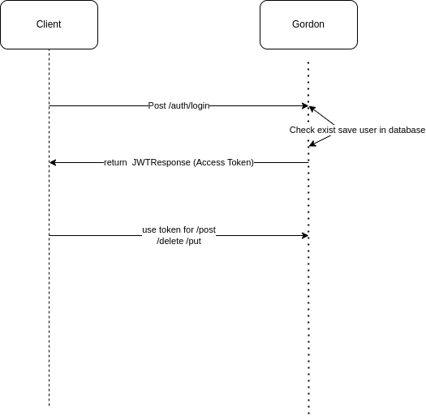

# Getting Started

### Recipe Recommender Project

This project is a small application that is implemented using Java programming language and Spring Boot, and the main business of this project is to recommend recipes.

The following technologies are used in this project

* [Apache Maven](https://maven.apache.org/guides/index.html)
* [Spring Boot](https://docs.spring.io/spring-boot/docs/3.0.5/maven-plugin/reference/html/)
* [Testcontainers MongoDB](https://www.testcontainers.org/modules/databases/mongodb/)
* [Testcontainers](https://www.testcontainers.org/)
* [Spring Data Reactive MongoDB](https://docs.spring.io/spring-boot/docs/3.0.5/reference/htmlsingle/#data.nosql.mongodb)
* [Spring Reactive Web](https://docs.spring.io/spring-boot/docs/3.0.5/reference/htmlsingle/#web.reactive)
* [OpenApi Swagger ](https://swagger.io/specification/)
* [json web token](https://github.com/jwtk/jjwt)
* [Spring Boot Security](https://docs.spring.io/spring-security/reference/reactive/getting-started.html)
* [Spring Boot Test](https://spring.io/guides/gs/testing-web/)
##### Table of Contents
[Architecture Design](#architecture-design)

[Why you choose Reactive Approach](#why-you-choose-reactive-approach)

[Authentication](#authentication)

[Next Level Of Architecture](#next-level-of-architecture)

[how you can start application](#how-you-can-start-application)


### Architecture Design
There were several solutions to implement this project
* Spring-boot(web-starter) + RDBMS(mysql) : I thought that I need to implement software that has a high ability to search text because of that I think twice I want to implement one stand-alone application and my application is going to do full-text search plus other criteria I am aiming for high throughput. As a result, it was not my choice
* Spring-boot + RDBMS(mysql) + Hibernate Full Text Search(Elastic Search):This was almost a complete architecture in terms of architecture and I had the experience of this architecture, it would have taken me more time to complete the implementation without defects.
* Spring-boot(Reactive) + Nosql(MongoDB)Reactive : With this choice, I could have a high processing ability, and on the other hand, because the main feature of this program was text search and the objects were in the form of documents, I could have two layers of objects. That's why I chose this method

  

* Finally, I used Spring Reactive for the implementation because I thought that I should implement an already supported application to have an acceptable processing speed.
* To create the basic information, I used the [mongo-init.js](docker-entrypoint-initdb.d%2Fmongo-init.js) file, which is executed by Docker Compose
### Why you choose Reactive Approach?
* Of course, I know that few companies use the reactive model these days.In fact, I know that maybe this is not the most complete answer, but I had to design a software that had a good performance when searching for text and different criteria, as a result, the main focus of users was on search, and what is better than a software with non-blocking approach from db until controller.And when the workload of the application increases, I can definitely get help from backpressure and use this feature [reference](https://www.baeldung.com/spring-mvc-async-vs-webflux)
  
### Authentication
* To implement this topic, I really wanted to use [keycloak plus OAUTH2](https://github.com/keycloak/keycloak), but the cost of implementation time was high for me, so I used a simple JWT model.
  

### Next Level Of Architecture
I thought it would be better if I add a short explanation of this.I think that if I were to upgrade this software from the architectural point of view, it would be very good, it would be upgraded in the form of DDD, that's why you see the word domain on one of the packages instead of entity, but obviously the user and business domains should be separate and they need separate boundaries,It is also necessary to add the infrastructure layer, so that if a technology like Kafka, NOSQL or RDBMS is needed, it should be implemented there, and besides that, the domains should communicate with each other in the form of async.


### how you can start application
you need clean install with maven build tools
```
mvn clean install
```
after passing all test cases gordon.jar will available target then you need start docker-compose process
```
docker-compose up -d
```
For swagger url you can use 
```
http://localhost:8080/webjars/swagger-ui/index.html
```